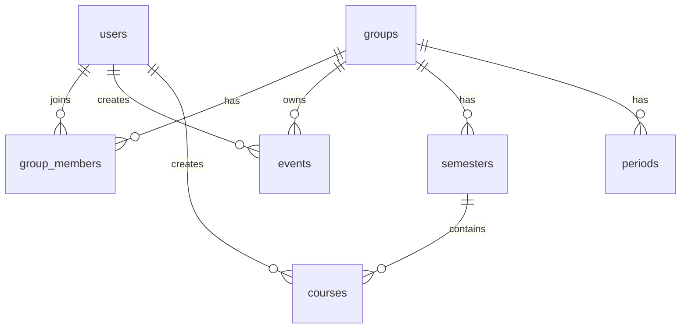

# 智群日程+课程表微信小程序 · MVP 决策稿

## 1. 决策结论

本项目 MVP 目标是：**8 周内完成一个可真机试用的微信小程序，支持群组共享日程、共享课程表、文本自然语言创建、基础实时同步。**

四项核心决策如下：

| 决策项 | 最终决定 |
|---|---|
| MVP 范围 | 群组、日程、课程表、文本 NLP 创建、基础 WebSocket 同步 |
| 前端选型 | 原生微信小程序 + TypeScript + Vant Weapp + wx-calendar |
| 后端选型 | FastAPI + MySQL + Redis + SQLAlchemy async + Alembic |
| 接口优先级 | 鉴权/群组 > 日程 > 课程表 > WebSocket > NLP |

不再摇摆的关键选择：

- **不使用 uni-app 作为 MVP 主框架**。
- **不直接复制 CCMeeting 代码，只参考业务流程**。
- **不在 MVP 做语音、提醒、AI 规划、复杂重复日程、后台管理系统**。
- **自然语言在 MVP 只做“创建”，不做复杂修改和删除**。

---

## 2. MVP 范围

### 2.1 MVP 必做功能

#### 用户与群组

| 功能 | MVP 要求 |
|---|---|
| 微信登录 | 用户通过微信登录，小程序拿到 code，后端换取 openid |
| 用户初始化 | 首次登录自动创建用户记录 |
| 创建群组 | 用户可创建一个群组，生成 6 位邀请码 |
| 加入群组 | 用户通过邀请码加入已有群组 |
| 群组切换 | 用户可以切换当前活跃群组 |
| 群组成员 | 可查看当前群组成员列表 |
| 权限控制 | 非群组成员不能访问群组数据 |

#### 共享日程

| 功能 | MVP 要求 |
|---|---|
| 月视图 | 使用 wx-calendar 做日期选择和日期标记 |
| 当日日程列表 | 点击某天后展示该日期所有日程 |
| 新增日程 | 支持手动新增 |
| 编辑日程 | 支持修改标题、时间、地点、备注、颜色 |
| 删除日程 | 使用软删除 |
| 日程标记 | 有日程的日期在日历上显示标记 |
| 课程联动 | 当天课程在日程列表中以课程样式展示 |

#### 共享课程表

| 功能 | MVP 要求 |
|---|---|
| 学期设置 | 群组设置学期开始日期和结束日期 |
| 当前教学周 | 根据学期开始日期自动计算当前周 |
| 周课程表 | 周一至周日、纵向节次的网格视图 |
| 新增课程 | 支持课程名、教师、地点、星期、节次、周次范围 |
| 编辑课程 | 支持修改课程字段 |
| 删除课程 | 使用软删除 |
| 默认节次 | MVP 内置 12 节默认时间，后续再开放自定义 |

#### 文本自然语言创建

| 功能 | MVP 要求 |
|---|---|
| 文本输入 | 用户输入一句话 |
| 日程创建解析 | 解析标题、日期、开始时间、结束时间、地点 |
| 课程创建解析 | 解析课程名、星期、节次、地点、周次 |
| 确认卡片 | 解析后只生成草稿，用户确认后才写入 |
| 手动回退 | 解析失败时进入手动表单 |

#### 基础实时同步

| 功能 | MVP 要求 |
|---|---|
| WebSocket 连接 | 进入群组后建立连接 |
| 群组频道 | 服务端按 group_id 维护频道 |
| 变更广播 | 日程/课程新增、修改、删除后广播 |
| 局部刷新 | 客户端收到事件后重新拉取相关日期或课程周数据 |
| 断线重连 | 前端做基础重连，重连后重新拉取当前页数据 |

### 2.2 MVP 明确不做

| 不做项 | 原因 |
|---|---|
| 语音转文字 | 微信语音能力和识别服务需要单独验证，放到 Beta |
| 微信订阅消息提醒 | 审核和用户授权链路较复杂，放到上线版 |
| 复杂重复日程 | 会显著增加数据模型和 UI 复杂度 |
| 拖拽调整时间 | 小程序手势和日历交互成本高，先用编辑表单 |
| 冲突检测 | 借鉴 CCMeeting，但 MVP 不拦截，只在 Beta 做提醒 |
| AI 智能规划 | 没有足够真实数据前价值不稳定 |
| 多群组个人总览 | MVP 只看当前群组 |
| 独立后台管理系统 | 群组管理先在小程序内完成 |
| 课程导入 | 第一版先手动录入和 NLP 创建 |
| 单双周/隔周 | 课程规则先只做全周 + 周次范围 |

### 2.3 MVP 验收标准

MVP 通过的标准不是“功能全”，而是以下 8 件事必须稳定：

1. 两个用户可以登录并加入同一群组。
2. 用户 A 创建日程，用户 B 能看到。
3. 用户 A 修改或删除日程，用户 B 能同步更新。
4. 用户可以设置学期并查看当前周课程表。
5. 用户可以添加课程，并在课程表和当天日程中看到。
6. 用户输入“明天下午3点开会，403会议室，持续2小时”能生成日程草稿。
7. 用户输入“高数，周一1-2节，教一楼205，1-16周”能生成课程草稿。
8. 解析失败、网络失败、无数据时都有可理解的界面状态。

---

## 3. 前端选型

### 3.1 最终选择

MVP 前端采用：

```text
原生微信小程序 + TypeScript + Vant Weapp + wx-calendar
```

### 3.2 为什么不选 uni-app

ColorTimetable 是 uni-app 课程表组件，但本项目 MVP 不选 uni-app，原因如下：

| 原因 | 说明 |
|---|---|
| 只发布微信小程序 | 暂无多端需求，跨端框架价值不高 |
| 微信原生能力优先 | 登录、WebSocket、审核、真机调试用原生路线更直接 |
| wx-calendar 更适合原生接入 | 日程页依赖日历组件，原生小程序接入更稳 |
| 降低框架变量 | MVP 阶段减少构建链路和跨端适配问题 |
| 课程表可以自研 | ColorTimetable 的价值主要是交互参考，不必强制复用代码 |

### 3.3 三个参考项目如何使用

| 参考项目 | 使用方式 |
|---|---|
| ColorTimetable | 参考课程表布局、课程卡片、详情弹层、周次切换，不直接迁移 uni-app 代码 |
| wx-calendar | 作为日程页日历底座，优先接入或参考其组件设计 |
| CCMeeting | 参考预约流程、详情页、时间冲突思路和小程序业务闭环，不复用代码 |

### 3.4 前端页面结构

MVP 保留 3 个底部 Tab：

| Tab | 页面 | 说明 |
|---|---|---|
| 日程 | `/pages/calendar/index` | 月历 + 当日日程列表 |
| 课程表 | `/pages/timetable/index` | 当前周课程表 |
| 群组 | `/pages/group/index` | 群组切换、成员、邀请码 |

辅助页面：

| 页面 | 路径 | 说明 |
|---|---|---|
| 登录页 | `/pages/login/index` | 微信登录授权 |
| 日程编辑页 | `/pages/event-edit/index` | 新增/编辑日程 |
| 课程编辑页 | `/pages/course-edit/index` | 新增/编辑课程 |
| NLP 输入页/弹层 | `/components/nlp-input` | 自然语言输入 |
| 确认卡片 | `/components/parse-confirm-card` | 解析结果确认 |

### 3.5 前端状态管理

MVP 不引入复杂状态库。

推荐状态分层：

| 状态 | 存放位置 |
|---|---|
| token | 本地 storage |
| 当前用户 | app globalData + 页面按需刷新 |
| 当前群组 | 本地 storage + app globalData |
| 当前日期 | 日程页页面状态 |
| 当前教学周 | 课程表页页面状态 |
| WebSocket 状态 | app 级连接管理模块 |

---

## 4. 数据库模型

### 4.1 MVP 表清单

MVP 只建 7 张核心表：

| 表 | 说明 |
|---|---|
| `users` | 用户 |
| `groups` | 群组 |
| `group_members` | 群组成员 |
| `semesters` | 学期 |
| `periods` | 节次时间 |
| `events` | 普通日程 |
| `courses` | 课程 |

暂不建：

- `event_occurrence_overrides`
- `operation_logs`
- `notifications`
- `course_import_tasks`
- `group_invitations`

这些表等 Beta 或上线版再加。

### 4.2 users

| 字段 | 类型 | 必填 | 说明 |
|---|---|---|---|
| id | bigint | 是 | 主键 |
| openid | varchar(64) | 是 | 微信 openid，唯一 |
| unionid | varchar(64) | 否 | 后续开放平台使用 |
| nickname | varchar(64) | 否 | 用户昵称 |
| avatar_url | varchar(512) | 否 | 头像 |
| created_at | datetime | 是 | 创建时间 |
| updated_at | datetime | 是 | 更新时间 |

索引：

```text
unique(openid)
```

### 4.3 groups

| 字段 | 类型 | 必填 | 说明 |
|---|---|---|---|
| id | bigint | 是 | 主键 |
| name | varchar(64) | 是 | 群组名 |
| creator_id | bigint | 是 | 创建者用户 ID |
| invite_code | varchar(12) | 是 | 邀请码，MVP 使用 6 位 |
| created_at | datetime | 是 | 创建时间 |
| updated_at | datetime | 是 | 更新时间 |
| deleted_at | datetime | 否 | 软删除 |

索引：

```text
unique(invite_code)
index(creator_id)
```

### 4.4 group_members

| 字段 | 类型 | 必填 | 说明 |
|---|---|---|---|
| id | bigint | 是 | 主键 |
| group_id | bigint | 是 | 群组 ID |
| user_id | bigint | 是 | 用户 ID |
| role | varchar(20) | 是 | creator/member，MVP 只用这两个 |
| joined_at | datetime | 是 | 加入时间 |
| left_at | datetime | 否 | 退出时间，MVP 可暂不开放退出 |

索引：

```text
unique(group_id, user_id)
index(user_id)
index(group_id)
```

### 4.5 semesters

| 字段 | 类型 | 必填 | 说明 |
|---|---|---|---|
| id | bigint | 是 | 主键 |
| group_id | bigint | 是 | 群组 ID |
| name | varchar(64) | 是 | 学期名 |
| start_date | date | 是 | 学期开始日期 |
| end_date | date | 是 | 学期结束日期 |
| is_current | boolean | 是 | 是否当前学期 |
| created_at | datetime | 是 | 创建时间 |
| updated_at | datetime | 是 | 更新时间 |

索引：

```text
index(group_id, is_current)
index(group_id, start_date)
```

规则：

- MVP 每个群组只允许一个当前学期。
- 如果用户未设置学期，课程表页先引导设置。

### 4.6 periods

| 字段 | 类型 | 必填 | 说明 |
|---|---|---|---|
| id | bigint | 是 | 主键 |
| group_id | bigint | 是 | 群组 ID |
| period_index | int | 是 | 第几节 |
| start_time | time | 是 | 开始时间 |
| end_time | time | 是 | 结束时间 |

索引：

```text
unique(group_id, period_index)
```

规则：

- 创建群组时自动生成默认 12 节。
- MVP 不提供自定义节次界面，但后端模型保留能力。

### 4.7 events

| 字段 | 类型 | 必填 | 说明 |
|---|---|---|---|
| id | bigint | 是 | 主键 |
| group_id | bigint | 是 | 群组 ID |
| creator_id | bigint | 是 | 创建者 ID |
| title | varchar(100) | 是 | 标题 |
| location | varchar(100) | 否 | 地点 |
| note | text | 否 | 备注 |
| start_time | datetime | 是 | 开始时间 |
| end_time | datetime | 是 | 结束时间 |
| is_all_day | boolean | 是 | 是否全天 |
| color_tag | varchar(32) | 否 | 颜色标签 |
| source | varchar(20) | 是 | manual/nlp |
| version | int | 是 | 乐观锁版本 |
| created_at | datetime | 是 | 创建时间 |
| updated_at | datetime | 是 | 更新时间 |
| deleted_at | datetime | 否 | 软删除 |

索引：

```text
index(group_id, start_time, end_time)
index(group_id, deleted_at)
index(creator_id)
```

规则：

- MVP 不存 repeat_rule。
- `end_time` 必须大于 `start_time`。
- 删除只设置 `deleted_at`。

### 4.8 courses

| 字段 | 类型 | 必填 | 说明 |
|---|---|---|---|
| id | bigint | 是 | 主键 |
| group_id | bigint | 是 | 群组 ID |
| semester_id | bigint | 是 | 学期 ID |
| creator_id | bigint | 是 | 创建者 ID |
| name | varchar(100) | 是 | 课程名 |
| teacher | varchar(64) | 否 | 教师 |
| location | varchar(100) | 否 | 地点 |
| day_of_week | int | 是 | 星期，1-7 |
| start_period | int | 是 | 开始节次 |
| end_period | int | 是 | 结束节次 |
| week_start | int | 是 | 开始周 |
| week_end | int | 是 | 结束周 |
| color_tag | varchar(32) | 否 | 颜色标签 |
| source | varchar(20) | 是 | manual/nlp |
| version | int | 是 | 乐观锁版本 |
| created_at | datetime | 是 | 创建时间 |
| updated_at | datetime | 是 | 更新时间 |
| deleted_at | datetime | 否 | 软删除 |

索引：

```text
index(group_id, semester_id, day_of_week)
index(group_id, semester_id, week_start, week_end)
index(creator_id)
```

规则：

- MVP 只支持全周，不做单双周。
- 一个课程如果有多个上课时间，MVP 建议创建多条 course 记录，前端显示为同名课程。
- `end_period` 必须大于等于 `start_period`。
- `week_end` 必须大于等于 `week_start`。

### 4.9 数据关系



---

## 5. 接口优先级

### 5.1 总体优先级

| 优先级 | 模块 | 原因 |
|---|---|---|
| P0 | 健康检查、鉴权、当前用户、群组 | 所有功能的前置条件 |
| P1 | 日程 CRUD 和日历查询 | 日程首页核心闭环 |
| P2 | 学期、节次、课程 CRUD | 课程表核心闭环 |
| P3 | WebSocket 同步 | 多人协作核心卖点 |
| P4 | NLP 解析与确认 | 提升效率，但必须依赖 CRUD |

开发顺序：

```text
P0 -> P1 -> P2 -> P3 -> P4
```

### 5.2 P0：基础与群组接口

必须最先完成。

| 方法 | 路径 | 说明 |
|---|---|---|
| GET | `/api/health` | 健康检查 |
| POST | `/api/auth/wechat-login` | 微信登录，返回 token |
| GET | `/api/users/me` | 当前用户信息 |
| PATCH | `/api/users/me` | 更新昵称和头像 |
| POST | `/api/groups` | 创建群组 |
| GET | `/api/groups` | 我的群组列表 |
| POST | `/api/groups/join` | 使用邀请码加入群组 |
| GET | `/api/groups/{group_id}` | 群组详情 |
| GET | `/api/groups/{group_id}/members` | 群组成员列表 |

P0 验收：

- 未登录访问业务接口返回 401。
- 非群组成员访问群组接口返回 403。
- 用户创建群组后自动成为 creator。
- 邀请码重复时自动重试生成。

### 5.3 P1：日程接口

第二优先级，用来跑通日程首页。

| 方法 | 路径 | 说明 |
|---|---|---|
| GET | `/api/groups/{group_id}/events` | 按时间范围查询日程 |
| GET | `/api/groups/{group_id}/events/daily` | 查询某天日程，含课程联动 |
| GET | `/api/groups/{group_id}/events/marks` | 查询日历标记 |
| POST | `/api/groups/{group_id}/events` | 创建日程 |
| GET | `/api/groups/{group_id}/events/{event_id}` | 日程详情 |
| PATCH | `/api/groups/{group_id}/events/{event_id}` | 修改日程 |
| DELETE | `/api/groups/{group_id}/events/{event_id}` | 删除日程 |

P1 验收：

- 可查询一个月内哪些日期有日程。
- 可查询某一天的日程列表。
- 创建、编辑、删除后数据正确。
- 删除后的日程不再出现在列表中。

### 5.4 P2：课程表接口

第三优先级，用来跑通课程表页。

| 方法 | 路径 | 说明 |
|---|---|---|
| GET | `/api/groups/{group_id}/semesters/current` | 当前学期 |
| POST | `/api/groups/{group_id}/semesters` | 创建或设置当前学期 |
| GET | `/api/groups/{group_id}/periods` | 获取节次配置 |
| GET | `/api/groups/{group_id}/courses` | 按学期和教学周查询课程 |
| POST | `/api/groups/{group_id}/courses` | 创建课程 |
| GET | `/api/groups/{group_id}/courses/{course_id}` | 课程详情 |
| PATCH | `/api/groups/{group_id}/courses/{course_id}` | 修改课程 |
| DELETE | `/api/groups/{group_id}/courses/{course_id}` | 删除课程 |

P2 验收：

- 新群组自动有默认节次。
- 设置学期后可计算当前教学周。
- 可按当前教学周显示课程。
- 同一课程多时间段可用多条记录表达。

### 5.5 P3：WebSocket 同步接口

第四优先级，在 CRUD 稳定后接入。

连接地址：

```text
GET /ws/groups/{group_id}?token={jwt}
```

服务端推送事件：

| 类型 | 说明 |
|---|---|
| `event.created` | 日程创建 |
| `event.updated` | 日程修改 |
| `event.deleted` | 日程删除 |
| `course.created` | 课程创建 |
| `course.updated` | 课程修改 |
| `course.deleted` | 课程删除 |
| `group.member_joined` | 成员加入 |

事件格式：

```json
{
  "type": "event.created",
  "group_id": 1,
  "entity": "event",
  "entity_id": 100,
  "version": 1,
  "operator_id": 10,
  "occurred_at": "2026-06-12T16:00:00+08:00"
}
```

P3 验收：

- A 用户创建日程，B 用户 2 秒内收到事件。
- B 收到事件后重新拉取当前日期数据。
- 断线后能自动重连。
- 非群组成员不能建立 WebSocket。

### 5.6 P4：NLP 接口

最后接入。NLP 不直接写库，必须先生成草稿。

| 方法 | 路径 | 说明 |
|---|---|---|
| POST | `/api/nlp/parse` | 解析自然语言，返回草稿 |
| POST | `/api/nlp/confirm` | 确认草稿并创建日程或课程 |

解析请求：

```json
{
  "group_id": 1,
  "text": "明天下午3点开会，403会议室，持续2小时",
  "context": {
    "current_date": "2026-06-12",
    "timezone": "Asia/Shanghai"
  }
}
```

解析响应：

```json
{
  "intent": "create_event",
  "confidence": 0.86,
  "draft": {
    "title": "开会",
    "start_time": "2026-06-13T15:00:00+08:00",
    "end_time": "2026-06-13T17:00:00+08:00",
    "location": "403会议室"
  },
  "warnings": []
}
```

P4 验收：

- 10 个日程创建句式成功率大于 80%。
- 10 个课程创建句式成功率大于 70%。
- 缺字段时返回 warnings，不直接失败。
- 解析失败时前端能进入手动表单。

---

## 6. 开发排期

### 6.1 8 周 MVP 排期

| 周 | 重点 | 产出 |
|---|---|---|
| 第 1 周 | 原型、数据模型、接口契约 | 页面草图、ER 图、OpenAPI 草案 |
| 第 2 周 | P0 后端 + 登录群组前端 | 登录、群组创建/加入可用 |
| 第 3 周 | P1 日程后端 + 日历页 | 日程 CRUD、月历标记、当日日程列表 |
| 第 4 周 | P2 课程后端 + 课程表页 | 学期、节次、课程 CRUD、周课表 |
| 第 5 周 | 日程和课程联动 | 当天日程显示课程、核心页面打通 |
| 第 6 周 | P3 WebSocket | 多用户实时同步 |
| 第 7 周 | P4 NLP 创建 | 文本解析、确认卡片、手动回退 |
| 第 8 周 | 真机测试和修复 | MVP 演示版、测试报告、下阶段清单 |

### 6.2 第一阶段交付顺序

最小纵向闭环：

1. 登录。
2. 创建群组。
3. 创建日程。
4. 在日历上看到日程标记。
5. 另一个用户加入群组并看到同一条日程。

第二闭环：

1. 设置学期。
2. 创建课程。
3. 在课程表看到课程。
4. 在当天日程中看到课程。

第三闭环：

1. 输入自然语言。
2. 生成草稿。
3. 确认创建。
4. 广播同步。

---

## 7. 前后端分工

### 7.1 后端负责人

优先负责：

- FastAPI 项目结构。
- MySQL 表模型。
- Alembic 迁移。
- 微信登录。
- JWT 权限。
- 群组权限校验。
- 日程、课程接口。
- WebSocket 频道管理。
- NLP 解析模块。

### 7.2 前端负责人

优先负责：

- 原生小程序 TypeScript 项目搭建。
- Vant Weapp 引入。
- wx-calendar 接入。
- 课程表网格组件。
- 登录、群组、日程、课程页面。
- WebSocket 客户端。
- NLP 输入和确认卡片。

### 7.3 API 协作方式

规则：

- 后端先出 OpenAPI。
- 前端基于 OpenAPI 写请求封装。
- 所有响应统一格式。
- 错误码必须稳定。
- 每个接口必须有权限测试。

统一响应格式：

```json
{
  "data": {},
  "error": null
}
```

错误响应：

```json
{
  "data": null,
  "error": {
    "code": "GROUP_NOT_FOUND",
    "message": "群组不存在"
  }
}
```

---

## 8. 后续版本边界

### 8.1 Beta 再做

- 单双周课程。
- 节次时间自定义界面。
- 日程冲突检测。
- 修改/删除类自然语言。
- Redis Pub/Sub 支持多 worker。
- 群组退出和解散。
- 邀请海报。

### 8.2 上线版再做

- 微信订阅消息提醒。
- 隐私协议和注销入口。
- 数据导出。
- 操作日志。
- 数据库备份。
- 错误监控。
- 微信审核材料。

---

## 9. 最终开发口径

MVP 的一句话定义：

> 一个原生微信小程序，用户可以创建群组，在群组内共享日程和课程表，并通过文本自然语言快速创建条目，成员之间能基础实时同步。

如果开发过程中出现范围争议，以这个口径为准：

- 不能支撑群组共享的功能，先不做。
- 不能支撑日程或课程核心闭环的功能，先不做。
- 不能在 8 周内稳定真机演示的功能，先不做。
- 所有 NLP 结果必须确认后执行。
- 所有群组数据必须做成员权限校验。

