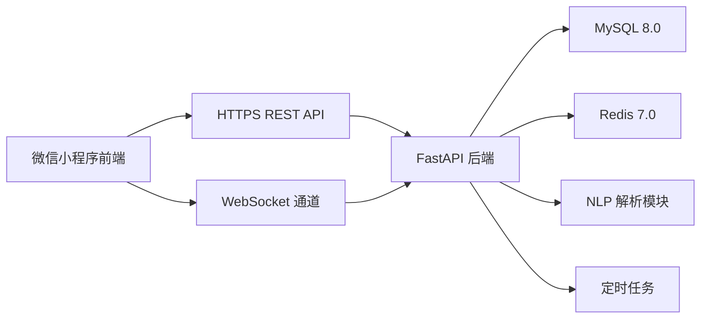
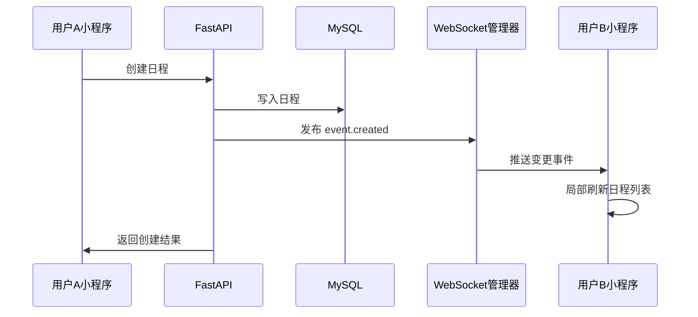

# 智群日程+课程表微信小程序 · 重构项目计划书

## 版本信息

| 项目 | 内容 |
|---|---|
| 文档版本 | v2.0 |
| 创建日期 | 2026-06-12 |
| 项目阶段 | MVP 立项与技术方案重构 |
| 参考项目 | ColorTimetable、wx-calendar、CCMeeting |
| 推荐路线 | 小程序前端 + Python 后端 |

---

## 1. 项目定位

### 1.1 项目名称

暂定：**智群日程**

副标题：面向班级、小组、家庭的共享日程与课程表工具。

### 1.2 项目目标

打造一款微信小程序，让小团体可以共同维护一份实时同步的日程表和课程表。用户可以创建群组、邀请成员加入，在群组内共享日程、课程安排，并通过文本自然语言快速创建或修改条目。

第一版不追求完整替代专业日历工具，而是聚焦三个高频场景：

1. 班级或学习小组共享课程表。
2. 小组成员共享会议、作业、活动安排。
3. 用一句话快速添加日程或课程，降低录入成本。

### 1.3 核心价值

| 价值 | 说明 |
|---|---|
| 共享 | 群组成员看到同一份日程和课程表，减少重复沟通 |
| 快速 | 支持手动录入和自然语言录入，减少填写表单的阻力 |
| 清晰 | 日历视图、课程表视图分离，避免课程和普通日程混乱 |
| 实时 | 成员修改后通过 WebSocket 推送给其他在线成员 |
| 轻量 | 微信小程序即开即用，适合班级、小组、家庭场景 |

---

## 2. 开源项目参考与吸收策略

本项目不建议直接照搬某一个开源项目，而是拆分吸收三个项目的优势。

### 2.1 ColorTimetable

项目地址：[nei1ee/ColorTimetable](https://github.com/nei1ee/ColorTimetable)

该项目是 uni-app 课程表组件，支持微信小程序和 QQ 小程序。其 README 中明确包含可视化周选择、课程删除、课程置顶、课程详情卡片、添加和编辑课程页等能力。

可借鉴内容：

| 模块 | 借鉴点 |
|---|---|
| 课程表周视图 | 横向星期、纵向节次的课程网格 |
| 课程卡片 | 颜色区分、课程名突出、地点/教师简略显示 |
| 课程详情 | 点击卡片展开详情，减少主表格拥挤 |
| 周次选择 | 顶部切换当前教学周 |
| 课程编辑 | 添加/编辑课程表单结构 |

吸收方式：

- 如果前端采用 uni-app，可优先参考其组件结构和数据结构。
- 如果前端采用原生微信小程序，则仅参考交互和视觉，不直接迁移 Vue 组件。
- 课程数据结构需要改造为后端统一模型，不能只停留在本地组件状态。

### 2.2 wx-calendar

项目地址：[lspriv/wx-calendar](https://github.com/lspriv/wx-calendar)

该项目是微信小程序日历组件，支持年、月、周、日程视图，支持 skyline 和 webview 渲染，并支持插件扩展。

可借鉴内容：

| 模块 | 借鉴点 |
|---|---|
| 日历基础组件 | 月视图、周视图、日程视图 |
| 日程标记 | marks 数据结构用于显示某日有事件 |
| 手势交互 | 左右滑动切换日期、视图切换 |
| 主题扩展 | 暗色模式、样式变量、自定义区域 |
| 插件机制 | 后续支持节假日、农历、考试周等扩展 |

吸收方式：

- MVP 阶段可直接使用该组件作为日程页日历底座。
- 只把它作为前端视图组件，事件数据仍由后端 API 管理。
- 日程列表、事件 CRUD、权限、同步逻辑由本项目自研。

### 2.3 CCMeeting

项目地址：[wangbingbing2022/CCMeeting](https://github.com/wangbingbing2022/CCMeeting)

该项目是会议室预定小程序，解决空闲会议室查询、日程时间协调、会议创建和后台管理等问题。它使用小程序云开发路线，但业务流程对本项目很有参考价值。

可借鉴内容：

| 模块 | 借鉴点 |
|---|---|
| 时间冲突检测 | 新建日程前判断是否与已有日程冲突 |
| 空闲时间查询 | 后续可扩展为“推荐会议时间” |
| 预约详情 | 日程详情页结构和确认流程 |
| 后台管理 | 群组、成员、公告、审核等管理思路 |
| 小程序码分享 | 后续群组邀请码、课程表分享可参考 |

吸收方式：

- 不采用其云开发架构，继续使用 Python 后端。
- 借鉴“查询可用时间段、创建预约、查看详情、后台管理”的业务流程。
- 后台管理先不做完整管理端，MVP 只做群组管理页。

### 2.4 许可证与复用边界

| 项目 | 许可证情况 | 建议 |
|---|---|---|
| ColorTimetable | MIT | 可参考或复用，但需保留许可证声明 |
| wx-calendar | MIT | 可作为 npm 组件使用，并保留许可证声明 |
| CCMeeting | 未明确识别到标准开源许可证 | 仅参考产品流程和交互，不直接复制代码 |

---

## 3. 产品范围重构

原计划中的功能较完整，但对两人团队来说范围偏大。新版拆成三个版本。

### 3.1 MVP 版本

目标：4 到 6 周内做出可真机演示、可小范围试用的版本。

必须完成：

| 模块 | 功能 |
|---|---|
| 用户 | 微信登录、用户资料初始化 |
| 群组 | 创建群组、邀请码加入群组、切换当前群组 |
| 日程 | 月视图、日期选择、日程列表、新增/编辑/删除 |
| 课程表 | 当前周课程表、新增/编辑/删除课程、学期起始日设置 |
| 自然语言 | 文本输入创建日程、文本输入创建课程 |
| 实时同步 | 群组内日程和课程变更 WebSocket 推送 |
| 权限 | 群组成员可读写，非成员不可访问 |

暂不做：

- 语音转文字。
- 微信服务通知提醒。
- 复杂重复事件例外。
- AI 智能规划。
- 历史恢复。
- 多群组个人总览。
- 独立后台管理系统。

### 3.2 Beta 版本

目标：在 MVP 试用反馈基础上补齐真实使用所需能力。

新增：

| 模块 | 功能 |
|---|---|
| 日程 | 周视图、日视图、重复事件、冲突检测 |
| 课程表 | 单双周、隔周、节次时间自定义 |
| 自然语言 | 修改/删除意图识别，歧义确认 |
| 协作 | Redis Pub/Sub 支持多实例广播 |
| 群组 | 成员角色、创建者解散群组、退出群组 |
| 分享 | 邀请码海报、当天日程文本分享 |

### 3.3 上线版本

目标：支持微信审核和稳定上线。

新增：

| 模块 | 功能 |
|---|---|
| 通知 | 微信订阅消息提醒 |
| 安全 | 隐私协议、数据导出、账号注销入口 |
| 稳定性 | 操作日志、关键错误监控、数据库备份 |
| 体验 | 空状态、异常状态、加载状态完善 |
| 审核 | 小程序审核材料、隐私说明、服务类目配置 |

---

## 4. 目标用户与典型场景

### 4.1 目标用户

| 用户 | 场景 |
|---|---|
| 班级学生 | 共享课程表、考试安排、作业截止日 |
| 学习小组 | 共享自习、会议、讨论时间 |
| 家庭 | 共享家庭成员日程、孩子课程、活动提醒 |
| 小团队 | 共享轻量会议和任务节点 |

### 4.2 核心用户故事

1. 作为班级成员，我希望加入班级群组后直接看到本周课程表。
2. 作为小组成员，我希望有人添加会议后，我的小程序能立即同步。
3. 作为课程表维护者，我希望可以一次录入“高数，周一 1-2 节，1-16 周”，自动生成课程安排。
4. 作为家庭成员，我希望看到某一天所有家庭活动，而不用翻聊天记录。
5. 作为普通用户，我希望自然语言解析不准确时还能手动修改确认。

---

## 5. 功能规划

### 5.1 用户与群组

MVP 功能：

- 微信登录，后端通过 `code2session` 获取 `openid`。
- 首次登录自动创建用户档案。
- 创建群组，生成 6 位邀请码。
- 输入邀请码加入群组。
- 顶部群组切换器切换当前活跃群组。
- 群组成员默认拥有同等读写权限。

Beta 功能：

- 群组角色：creator、admin、member。
- 创建者可解散群组。
- 成员可退出群组。
- 群组二维码或小程序码邀请。

### 5.2 共享日程

MVP 功能：

- 月视图作为默认首页。
- 日期下方显示日程标记。
- 点击日期展示当日日程列表。
- 手动新增、编辑、删除日程。
- 日程字段包括标题、开始时间、结束时间、地点、颜色标签、备注。
- 日程变更后广播给群组在线成员。

Beta 功能：

- 周视图和日视图。
- 拖拽调整时间。
- 重复事件：每天、每周、每月、自定义星期。
- 冲突检测：与已有日程或课程冲突时提醒。
- 修改重复事件时支持“仅本次”和“全部”。

### 5.3 共享课程表

MVP 功能：

- 设置学期起始日期。
- 自动计算当前教学周。
- 周一至周日课程网格。
- 纵向展示节次。
- 新增、编辑、删除课程。
- 课程字段包括课程名、教师、地点、星期、开始节次、结束节次、开始周、结束周。
- 课程在对应日期的日程页中以“课程”样式展示。

Beta 功能：

- 单周、双周、全周。
- 自定义节次时间。
- 多时间段课程，例如同一课程周一 1-2 节、周三 3-4 节。
- 课程置顶或颜色自定义。
- 导入/复制上一学期课程表。

### 5.4 自然语言交互

MVP 只做“创建”，不做复杂修改和删除。

支持示例：

- 明天下午3点开会，403会议室，持续2小时
- 周五晚上7点小组讨论
- 添加课程：高等数学，周一1-2节，教一楼205，1-16周
- 每周三下午4点英语口语课，1-12周

处理流程：

1. 用户点击右下角输入按钮。
2. 输入自然语言文本。
3. 后端 NLP 模块解析为结构化草稿。
4. 前端展示确认卡片。
5. 用户可修改字段。
6. 用户确认后正式写入数据库。

Beta 增加：

- 修改意图：把明天下午的会议改到后天上午10点。
- 删除意图：删除这周五的所有日程。
- 歧义确认：当匹配到多个候选日程时，让用户选择。

### 5.5 实时协作

MVP：

- 用户进入群组后建立 WebSocket。
- 服务端按 `group_id` 维护连接集合。
- 新增、修改、删除后向同组成员广播事件。
- 客户端收到事件后局部更新日程列表或课程表。

Beta：

- Redis Pub/Sub 支持多 worker、多实例广播。
- 每条变更事件带 `event_id`、`version`、`occurred_at`。
- 客户端断线重连后调用增量同步接口。
- 防止重复事件应用。

---

## 6. 页面与交互设计

### 6.1 底部导航

| Tab | 页面 | 说明 |
|---|---|---|
| 日程 | 日程首页 | 基于 wx-calendar 思路实现月视图和日程列表 |
| 课程表 | 课程表页 | 基于 ColorTimetable 思路实现周课程网格 |
| 群组 | 群组页 | 当前群组成员、邀请码、群组操作 |

原计划中群组入口放在顶部群组名中。新版建议 MVP 先放到底部 Tab，降低入口隐藏导致的使用成本。上线后可以根据使用情况改为顶部入口。

### 6.2 日程首页

布局：

- 顶部：当前群组选择器、今天按钮。
- 中部：月历组件。
- 下部：选中日期的日程列表。
- 右下角：新增按钮。

交互：

- 点击日期切换日程列表。
- 点击日程进入详情。
- 长按日程弹出编辑/删除菜单。
- 新增按钮弹出“自然语言创建”和“手动创建”。

### 6.3 课程表页

布局：

- 顶部：当前教学周、上一周/下一周按钮。
- 中部：周一到周日课程表网格。
- 左侧：节次列。
- 右下角：新增课程按钮。

交互：

- 点击课程卡片打开详情。
- 点击空白格新增课程，并自动带入星期和节次。
- 长按课程卡片编辑或删除。
- 顶部切换教学周后，课程根据周次规则过滤。

### 6.4 群组页

MVP：

- 群组名称。
- 邀请码。
- 成员列表。
- 创建群组。
- 加入群组。
- 切换群组。

Beta：

- 解散群组。
- 退出群组。
- 成员角色管理。
- 邀请海报。

### 6.5 自然语言确认卡片

确认卡片字段：

| 类型 | 字段 |
|---|---|
| 日程 | 标题、日期、开始时间、结束时间、地点、重复规则 |
| 课程 | 课程名、教师、地点、星期、节次、周次范围、单双周 |

设计原则：

- 解析结果必须可修改。
- 不允许“解析后直接执行”。
- 低置信度字段用高亮提示。
- 解析失败时回退到手动表单。

---

## 7. 技术架构

### 7.1 总体架构



### 7.2 前端技术路线

推荐方案：**uni-app + Vue 3 + TypeScript**。

理由：

- ColorTimetable 本身是 uni-app 课程表组件，更容易吸收课程表交互。
- wx-calendar 文档中提供了 UniApp 使用路径，可作为日历组件引入或迁移参考。
- TypeScript 有利于维护复杂的日程、课程、同步事件数据结构。

备选方案：**原生微信小程序 + Vant Weapp + wx-calendar + 自研课程表组件**。

适用条件：

- 团队更熟悉原生小程序。
- 只计划发布微信小程序，不考虑多端。
- 希望直接使用 wx-calendar 组件，减少跨框架适配成本。

本计划建议：

| 版本 | 前端策略 |
|---|---|
| MVP | 原生微信小程序或 uni-app 二选一，不同时混用 |
| 推荐 | 若团队会 Vue，选 uni-app；若团队更熟悉小程序原生，选原生 |
| 不建议 | 为了同时复用两个组件而强行混合架构 |

### 7.3 后端技术路线

| 层级 | 技术 |
|---|---|
| Web 框架 | FastAPI |
| ASGI 服务 | Uvicorn |
| 数据库 | MySQL 8.0 |
| ORM | SQLAlchemy 2.0 async |
| 迁移 | Alembic |
| 缓存与广播 | Redis 7.0 |
| 鉴权 | JWT + 微信 code2session |
| WebSocket | FastAPI WebSocket |
| NLP | dateparser + jieba + 正则规则引擎 |
| 部署 | Docker Compose |
| 反向代理 | Nginx |

### 7.4 为什么不采用 CCMeeting 的云开发架构

CCMeeting 的云开发路线适合快速上线，但本项目保留 Python 后端有几个原因：

1. 自然语言解析更适合放在 Python 服务中。
2. WebSocket、Redis Pub/Sub、后续任务调度更容易统一管理。
3. 数据模型复杂度高于普通预约小程序，关系型数据库更清晰。
4. 未来可以接入 LLM、异步任务、监控系统。

---

## 8. 数据库设计

### 8.1 核心表

| 表名 | 说明 |
|---|---|
| `users` | 用户基础信息 |
| `groups` | 群组信息 |
| `group_members` | 群组成员关系 |
| `events` | 普通日程 |
| `event_occurrence_overrides` | 重复日程例外，Beta 阶段 |
| `semesters` | 学期设置 |
| `periods` | 节次时间配置 |
| `course_templates` | 课程模板 |
| `course_sessions` | 多时间段课程拆分，Beta 阶段 |
| `operation_logs` | 操作日志，上线版本 |

### 8.2 表结构概要

#### users

| 字段 | 类型 | 说明 |
|---|---|---|
| id | bigint | 主键 |
| openid | varchar | 微信 openid，唯一 |
| nickname | varchar | 昵称 |
| avatar_url | varchar | 头像 |
| created_at | datetime | 创建时间 |
| updated_at | datetime | 更新时间 |

#### groups

| 字段 | 类型 | 说明 |
|---|---|---|
| id | bigint | 主键 |
| name | varchar | 群组名 |
| creator_id | bigint | 创建者 |
| invite_code | varchar | 6 位邀请码 |
| created_at | datetime | 创建时间 |

#### group_members

| 字段 | 类型 | 说明 |
|---|---|---|
| id | bigint | 主键 |
| group_id | bigint | 群组 ID |
| user_id | bigint | 用户 ID |
| role | varchar | creator/admin/member |
| joined_at | datetime | 加入时间 |

#### events

| 字段 | 类型 | 说明 |
|---|---|---|
| id | bigint | 主键 |
| group_id | bigint | 群组 ID |
| creator_id | bigint | 创建者 |
| title | varchar | 标题 |
| location | varchar | 地点 |
| start_time | datetime | 开始时间 |
| end_time | datetime | 结束时间 |
| is_all_day | boolean | 是否全天 |
| repeat_rule | text | RFC 5545 rrule，MVP 可为空 |
| color_tag | varchar | 颜色标签 |
| source | varchar | manual/nlp/course |
| version | bigint | 数据版本 |
| deleted_at | datetime | 软删除时间 |

#### semesters

| 字段 | 类型 | 说明 |
|---|---|---|
| id | bigint | 主键 |
| group_id | bigint | 群组 ID |
| name | varchar | 学期名 |
| start_date | date | 学期开始日期 |
| end_date | date | 学期结束日期 |

#### periods

| 字段 | 类型 | 说明 |
|---|---|---|
| id | bigint | 主键 |
| group_id | bigint | 群组 ID |
| period_index | int | 第几节 |
| start_time | time | 开始时间 |
| end_time | time | 结束时间 |

#### course_templates

| 字段 | 类型 | 说明 |
|---|---|---|
| id | bigint | 主键 |
| group_id | bigint | 群组 ID |
| semester_id | bigint | 学期 ID |
| name | varchar | 课程名 |
| teacher | varchar | 教师 |
| location | varchar | 地点 |
| day_of_week | int | 星期，1 到 7 |
| start_period | int | 开始节次 |
| end_period | int | 结束节次 |
| week_start | int | 开始周 |
| week_end | int | 结束周 |
| week_type | varchar | all/odd/even |
| color_tag | varchar | 颜色 |
| version | bigint | 数据版本 |
| deleted_at | datetime | 软删除时间 |

### 8.3 索引建议

| 表 | 索引 |
|---|---|
| users | unique(openid) |
| groups | unique(invite_code) |
| group_members | unique(group_id, user_id), index(user_id) |
| events | index(group_id, start_time, end_time), index(group_id, deleted_at) |
| semesters | index(group_id, start_date) |
| course_templates | index(group_id, semester_id, day_of_week), index(group_id, week_start, week_end) |

---

## 9. API 设计概要

### 9.1 鉴权

| 方法 | 路径 | 说明 |
|---|---|---|
| POST | `/api/auth/wechat-login` | 微信登录，返回 JWT |
| POST | `/api/auth/logout` | 退出登录，Beta 加入 JWT 黑名单 |
| GET | `/api/users/me` | 获取当前用户 |

### 9.2 群组

| 方法 | 路径 | 说明 |
|---|---|---|
| POST | `/api/groups` | 创建群组 |
| GET | `/api/groups` | 获取我加入的群组 |
| POST | `/api/groups/join` | 通过邀请码加入 |
| GET | `/api/groups/{group_id}` | 获取群组详情 |
| GET | `/api/groups/{group_id}/members` | 获取成员列表 |

### 9.3 日程

| 方法 | 路径 | 说明 |
|---|---|---|
| GET | `/api/groups/{group_id}/events` | 按时间范围查询日程 |
| POST | `/api/groups/{group_id}/events` | 创建日程 |
| PATCH | `/api/groups/{group_id}/events/{event_id}` | 修改日程 |
| DELETE | `/api/groups/{group_id}/events/{event_id}` | 删除日程 |
| GET | `/api/groups/{group_id}/events/conflicts` | 冲突检测，Beta |

### 9.4 课程表

| 方法 | 路径 | 说明 |
|---|---|---|
| GET | `/api/groups/{group_id}/semester/current` | 当前学期 |
| POST | `/api/groups/{group_id}/semesters` | 创建学期 |
| GET | `/api/groups/{group_id}/courses` | 查询课程 |
| POST | `/api/groups/{group_id}/courses` | 创建课程 |
| PATCH | `/api/groups/{group_id}/courses/{course_id}` | 修改课程 |
| DELETE | `/api/groups/{group_id}/courses/{course_id}` | 删除课程 |

### 9.5 NLP

| 方法 | 路径 | 说明 |
|---|---|---|
| POST | `/api/nlp/parse` | 解析自然语言，返回草稿 |
| POST | `/api/nlp/confirm` | 确认解析结果并创建数据 |

### 9.6 WebSocket

连接：

```text
GET /ws/groups/{group_id}?token=JWT
```

事件格式：

```json
{
  "type": "event.created",
  "group_id": 1001,
  "entity": "event",
  "entity_id": 9001,
  "version": 3,
  "operator_id": 2001,
  "occurred_at": "2026-06-12T10:00:00+08:00",
  "payload": {}
}
```

事件类型：

| 类型 | 说明 |
|---|---|
| `event.created` | 日程创建 |
| `event.updated` | 日程修改 |
| `event.deleted` | 日程删除 |
| `course.created` | 课程创建 |
| `course.updated` | 课程修改 |
| `course.deleted` | 课程删除 |
| `group.member_joined` | 成员加入 |

---

## 10. NLP 设计

### 10.1 MVP 解析目标

MVP 只要求解析“新增日程”和“新增课程”。

| 输入类型 | 输出 |
|---|---|
| 日程句子 | title、date、start_time、end_time、location |
| 课程句子 | name、day_of_week、periods、location、week_range |

### 10.2 规则优先级

1. 课程关键词优先：包含“课程”“课”“节”“周一1-2节”等，优先进入课程解析。
2. 日期时间优先：包含“明天”“后天”“周五”“下午3点”等，进入日程解析。
3. 地点识别：会议室、教室、楼、室、房间等后缀。
4. 持续时间识别：持续2小时、半小时、到5点。
5. 标题提取：去除时间、地点、持续时间后的主干文本。

### 10.3 置信度与回退

| 情况 | 处理 |
|---|---|
| 必填字段完整 | 展示确认卡片 |
| 缺少结束时间 | 默认 1 小时，可修改 |
| 缺少标题 | 要求用户补充 |
| 时间有歧义 | 要求用户选择 |
| 解析失败 | 切换到手动表单 |

### 10.4 后续 LLM 扩展

Beta 后可加入 LLM 作为增强解析器：

- 规则解析优先。
- 规则失败或低置信度时调用 LLM。
- LLM 只返回 JSON 草稿，不直接写库。
- 所有结果必须经过用户确认。

---

## 11. 实时同步与一致性

### 11.1 MVP 同步策略



### 11.2 冲突处理

MVP：

- 最后写入生效。
- 使用 `version` 防止旧数据覆盖新数据。
- 删除采用软删除。

Beta：

- 编辑时带上客户端已知版本。
- 如果版本落后，返回冲突状态。
- 前端提示“内容已被其他成员修改，请刷新后再编辑”。

### 11.3 断线补偿

MVP：

- WebSocket 断线后重连。
- 重连成功后重新拉取当前日期范围数据。

Beta：

- 客户端记录最后收到的 `version` 或 `occurred_at`。
- 调用 `/api/groups/{group_id}/changes?since=...` 拉取增量。

---

## 12. 部署与运维

### 12.1 MVP 部署

| 服务 | 说明 |
|---|---|
| FastAPI | 业务 API 和 WebSocket |
| MySQL | 主数据存储 |
| Redis | 缓存、在线状态、后续 Pub/Sub |
| Nginx | HTTPS 反向代理 |

### 12.2 Docker Compose 服务

```text
services:
  api:
    FastAPI + Uvicorn
  mysql:
    MySQL 8.0
  redis:
    Redis 7.0
  nginx:
    HTTPS reverse proxy
```

### 12.3 上线前必须完成

- HTTPS 域名备案和小程序服务器域名配置。
- 微信登录 `AppID`、`AppSecret` 后端保管。
- 数据库每日备份。
- 错误日志收集。
- 隐私协议和用户授权说明。
- 小程序审核类目确认。

---

## 13. 开发计划

### 13.1 推荐周期

建议按 **8 周** 做可上线 Beta，而不是原计划 7 周完成完整版本。

| 周期 | 目标 | 产出 |
|---|---|---|
| 第 1 周 | 需求冻结、技术选型、原型 | 页面原型、数据库 ER、API 草案 |
| 第 2 周 | 后端基础 | FastAPI、登录、JWT、MySQL、Alembic |
| 第 3 周 | 群组与日程 MVP | 群组接口、日程 CRUD、日历页接入 |
| 第 4 周 | 课程表 MVP | 学期、周次、课程 CRUD、课程表页 |
| 第 5 周 | WebSocket 同步 | 群组频道、前端监听、局部刷新 |
| 第 6 周 | NLP 创建 | 文本解析、确认卡片、手动回退 |
| 第 7 周 | 真机联调与体验修正 | 空状态、异常状态、性能优化 |
| 第 8 周 | 测试与审核准备 | Bug 修复、隐私协议、审核材料 |

### 13.2 MVP 里程碑

| 里程碑 | 验收标准 |
|---|---|
| M1 登录与群组 | 两个用户可加入同一群组 |
| M2 日程可用 | 可新增、编辑、删除，月历有标记 |
| M3 课程表可用 | 可设置学期并显示本周课程 |
| M4 实时同步 | A 修改后 B 端 2 秒内看到变化 |
| M5 NLP 创建 | 10 个常见句式解析成功率大于 80% |
| M6 真机演示 | 至少 3 台手机稳定完成核心流程 |

---

## 14. 团队分工

### 成员 A：后端主力

负责：

- FastAPI 项目结构。
- 数据库模型和 Alembic 迁移。
- 微信登录和 JWT。
- 群组、日程、课程接口。
- WebSocket 连接和广播。
- Docker Compose 部署。

### 成员 B：前端主力 + NLP 协作

负责：

- 小程序页面实现。
- 日程日历组件接入。
- 课程表组件实现。
- 自然语言输入面板和确认卡片。
- 前端状态管理和 WebSocket 客户端。
- NLP 规则样本整理和测试用例。

### 共同负责

- API 契约评审。
- 数据结构评审。
- 真机测试。
- 微信审核材料。

---

## 15. 测试计划

### 15.1 后端测试

| 类型 | 内容 |
|---|---|
| 单元测试 | NLP 解析、周次计算、冲突检测 |
| 接口测试 | 登录、群组、日程、课程 CRUD |
| 权限测试 | 非群组成员不可访问数据 |
| WebSocket 测试 | 加入频道、广播、断线重连 |

### 15.2 前端测试

| 类型 | 内容 |
|---|---|
| 组件测试 | 日历、课程表、确认卡片 |
| 真机测试 | iOS、Android、不同屏幕尺寸 |
| 网络测试 | 弱网、断线、重连 |
| 交互测试 | 新增、编辑、删除、切换群组 |

### 15.3 验收用例

1. 用户 A 创建群组，用户 B 输入邀请码加入。
2. 用户 A 添加明天下午 3 点会议，用户 B 端自动出现。
3. 用户 B 删除该会议，用户 A 端自动消失。
4. 用户 A 设置学期起始日后，课程表显示当前教学周。
5. 用户 A 添加“高数，周一 1-2 节，1-16 周”，课程表正确显示。
6. 用户输入无法解析的句子，系统能回退到手动表单。

---

## 16. 风险与应对

| 风险 | 概率 | 影响 | 应对 |
|---|---|---|---|
| 前端路线摇摆 | 中 | 高 | 开工前确定 uni-app 或原生，不混用 |
| NLP 准确率不足 | 高 | 中 | 只做创建场景，所有结果需确认 |
| WebSocket 多实例同步复杂 | 中 | 高 | MVP 单实例，Beta 加 Redis Pub/Sub |
| 微信审核或隐私问题 | 中 | 高 | 提前准备隐私协议、用户注销、数据说明 |
| 两人团队范围过大 | 高 | 高 | 严格按 MVP 范围开发 |
| 课程表规则复杂 | 中 | 中 | MVP 只做全周和周次范围，单双周后置 |
| 开源代码许可证风险 | 中 | 中 | MIT 项目保留声明，未授权项目只参考思路 |

---

## 17. 推荐决策

### 17.1 现在应立即确定的事项

1. 前端选型：uni-app 还是原生微信小程序。
2. 第一批目标用户：班级、小组还是家庭。
3. MVP 是否必须包含自然语言。
4. 是否计划上架微信审核，还是先内部体验版。
5. 服务器部署方式：云服务器 Docker Compose 还是临时开发环境。

### 17.2 推荐 MVP 决策

| 问题 | 推荐 |
|---|---|
| 前端 | 团队会 Vue 选 uni-app；否则选原生小程序 |
| 后端 | 保留 FastAPI + MySQL + Redis |
| 日历 | 优先参考或接入 wx-calendar |
| 课程表 | 参考 ColorTimetable 自研适配 |
| 冲突检测 | 参考 CCMeeting，但放到 Beta |
| NLP | MVP 只做文本创建 |
| 语音 | 上线版本再做 |
| 提醒 | 上线版本再做 |

---

## 18. 总结

重构后的项目不再追求一次性做出完整协作日历平台，而是先做一个清晰可落地的核心产品：

> 一个支持群组共享、课程表、日程表、文本自然语言创建和实时同步的微信小程序。

三个参考项目分别解决了本项目的不同部分：

- ColorTimetable 解决课程表交互参考。
- wx-calendar 解决日程日历底座参考。
- CCMeeting 解决预约、冲突和管理流程参考。

最稳妥的推进方式是先完成 MVP，再根据真实用户反馈决定是否扩展语音、提醒、AI 智能规划和多端能力。

